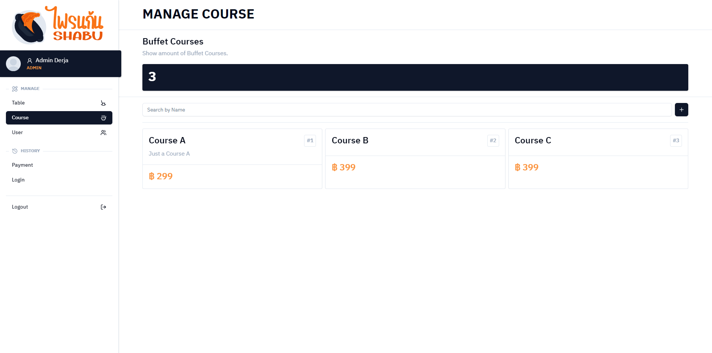
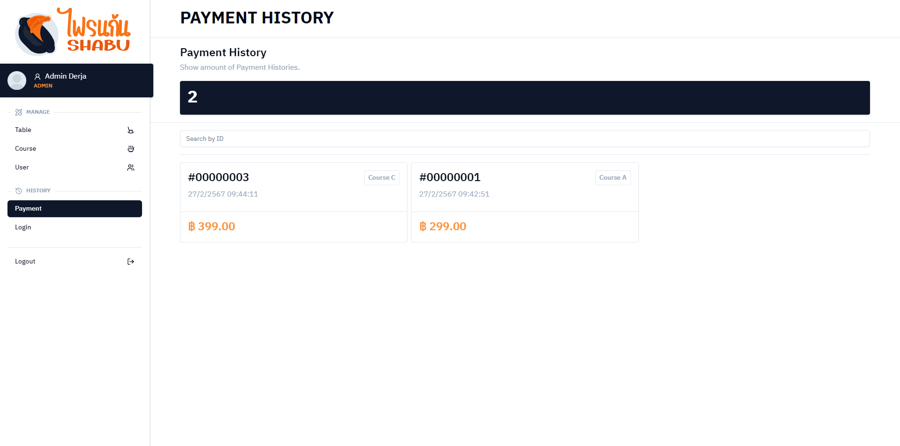

# How to run this project

## Setup MySQL

1. Install MySQL Installer v8.0.36 : <https://dev.mysql.com/downloads/installer/>
2. Install MySQL products
   1. MySQL Server v8.0.36
   2. MySQL Workbench v8.0.36
   3. Connector/J v8.0.36

## Setup Spring Boot (Backend)

1. Configure Backend/shabu/src/main/resources/application.properties

    ```bash
    # Set PORT, USERNAME, and PASSWORD to connect to MySQL
    spring.datasource.url=jdbc:mysql://localhost:<PORT>/shabu_db
    spring.datasource.username=<USERNAME>
    spring.datasource.password=<PASSWORD>
    ```

2. Run Backend/shabu/src/main/java/com/example/main/ShabuApplication.java to start Spring Boot
3. Send request to http://localhost:8082/api/init/ with GET method to initialize data

## Setup SvelteKit (Frontend)

Execute this command

```bash
npm install # or npm i
npm run dev
```

---

## Login Page


## Tables Page


## Table Detail Page


## Courses Page



## Course Detail Page


## User Page (Employee)

")

## User Page (Admin)

")

## Payment History Page



## Payment History Detail Page


## Login History Page


